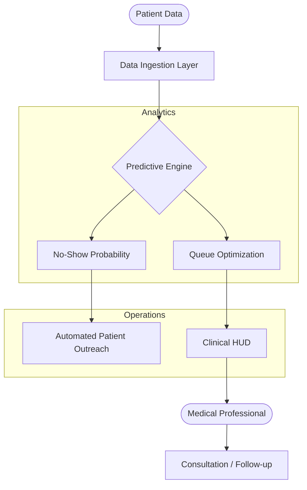

# 🏥 KIROV DYNAMICS | NOSHOWIQ
### High-Fidelity Healthcare Predictive Analytics

---

## 🚀 Overview

**NoShowIQ** is a predictive healthcare analytics engine designed to minimize patient no-shows and optimize clinic efficiency. Developed by **Kirov Dynamics Technology**, it demonstrates elite **AI Product Building** by turning complex clinical data into actionable medical intelligence.

> **"Predicting the future of healthcare delivery, one appointment at a time."**

---

## 🏗️ Architecture: Predictive Intelligence Plane

---

## ✨ Features

- **🎯 Real-Time Queue Management**: Doctors and admins can track waiting, in-consultation, and completed patients with dynamic updates.
- **📱 Mobile-First Design**: Fully responsive interface optimized for clinical environments.
- **🇿🇦 National Coverage**: Localized for South African healthcare facilities.
- **⚡ High Intelligence**: Driven by Kirov Dynamics autonomous orchestration.

---

## 🛠️ Tech Stack

- **Frontend**: Next.js 14, TypeScript, Tailwind CSS
- **Backend**: Python, FastAPI, SQLAlchemy
- **Database**: PostgreSQL (Production)
- **Deployment**: Vercel (Hardened)

---

## 👥 Contributors
- **Raphasha27** (Lead Architect & Sovereign Engineer)

---

© 2026 **Kirov Dynamics Technology** | Developed by **Raphasha27**
